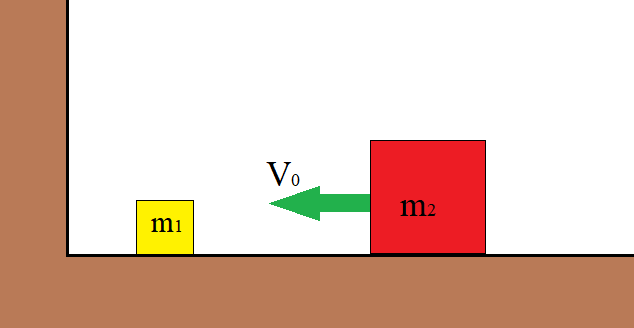

# Абсолютно упругое взаимодействие 

Выполнить численное моделирование абсолютно упругого взаимодействия двух тел разной массы.
Тело массой $m_2$, движущееся со скоростью $v_0$ сталкивается с неподвижным телом массой $m_1$.
Масса $m_1 < m_2$. Сколько соударений $N$ со стенкой, расположенной слева и телом массой $m_2$
совершит тело массой $m_1$ до полной остановки? Столкновения со стенкой и телами считать
абсолютно упругими.

$m_2 = m_1 \cdot 10^n$, где $n=1,2,3,4,\dots$
